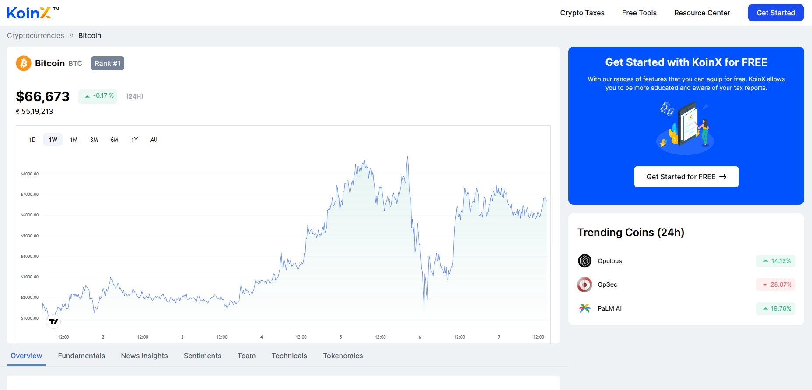

# KoinX Frontend Task

Welcome to the KoinX Frontend Task repository! This project utilizes **React.js**, **Tailwind CSS**, and **React Router DOM v6** to create an interactive web application for exploring cryptocurrency data.

## Preview

Click on the image above to view the live demo.

## Technologies Used
- **React.js**: A popular JavaScript library for building user interfaces.
- **Tailwind CSS**: A utility-first CSS framework for quickly building custom designs.
- **React Router DOM v6**: Declarative routing for React applications.

## Live Demo
Check out the live demo [here](https://koinx-assignment-zeta.vercel.app/). 

## Overview and Features
This project implements various components as per the provided Figma design, allowing users to explore cryptocurrency data. Here are some key features:

- **API Integration**: Utilizes CoinGecko API for fetching cryptocurrency data, including price, trending coins, and detailed information about specific coins.
- **Responsive Design**: Ensures compatibility across different devices, providing a seamless experience for users.
- **Dynamic URL Routing**: Users can dynamically change the coin name in the URL to view data and charts for different cryptocurrencies.
- **Error Handling**: Implemented robust error handling, displaying messages for invalid coin names or other errors.
- **Breadcrumb Navigation**: Offers intuitive breadcrumb navigation for easy traversal within the application.
- **Deployment**: Deployed on Vercel for easy access.

## Optional Tasks
- **Dynamic URL Paths**: Users can modify the coin name in the URL to access data for different cryptocurrencies.
- **Example URLs**:
  - `https://koinx-assignment-zeta.vercel.app/bitcoin` for Bitcoin
  - `https://koinx-assignment-zeta.vercel.app/ethereum` for Ethereum
  - `https://koinx-assignment-zeta.vercel.app/ripple` for Ripple

**Note**: The CoinGecko API has a rate limit of 30 calls per minute.

## How to Use
1. Visit the [live demo](https://koinx-assignment-zeta.vercel.app/).
2. Explore different cryptocurrencies by modifying the coin name in the URL.
3. Enjoy browsing through cryptocurrency data and charts!

Feel free to reach out if you have any questions or feedback. Happy exploring! 🚀
